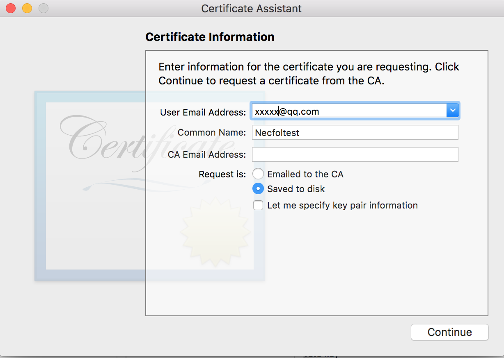

# iOS真机开发指南

## 1 前提

默认开发者已经有iOS开发者账号。账号类型区别可以在[账号说明](https://developer.apple.com/support/compare-memberships/)中查看。

## 2 创建证书
### 2.1 创建请求文件
在mac的应用里找到**钥匙串(Keychain Access)**应用

填写好证书信息，保存请求文件到电脑。(Email Address填开发者的邮件，common name是证书中密钥的名字，CA email address可以不填)

完成后在**钥匙串(Keychain Access)**应用中可以发现多了两个以common name命名的文件

private key保存在mac的Keychain Access中，用于签名（CodeSign）对外发布的App。 
public key一般随证书（随Provisioning Profile，随App）散布出去，对App签名进行校验认证，必须保护好本地Keychain中的private key，以防伪冒。

并且在相应文件夹中多了证书请求文件

解释：申请一个Certificate之前，需要先申请一个Certificate Signing Request (CSR) 文件，而这个过程中实际上是生成了一对公钥和私钥，保存在你Mac的Keychain中。代码签名正是使用这种基于非对称秘钥的加密方式，用私钥进行签名，用公钥进行验证。在你Mac的keychain的login中存储着相关的公钥和私钥，而证书中包含了公钥。你只能用私钥来进行签名，所以如果没有了私钥，就意味着你不能进行签名了，所以就无法使用这个证书了，此时你只能revoke之前的证书再申请一个。因此在申请完证书时，最好导出并保存好你的私钥。当你想与其他人或其他设备共享证书时，把私钥传给它就可以了。私钥保存在你的Mac中，而苹果生成的Certificate中包含了公钥。当你用自己的私钥对代码签名后，苹果就可以用证书中的公钥来进行验证，确保是你对代码进行了签名，而不是别人冒充你，同时也确保代码的完整性等。 
### 2.2 创建证书
登陆[苹果开发者官网](https://developer.apple.com)，[申请证书](https://developer.apple.com/account/ios/certificate/create)

证书有两种:  
Development(开发证书)
`开发证书用于开发和调试应用程序，可用于联机调试`

* App Development：用来开发和真机调试应用程序。
* Push Development：用来调试Apple Push Notification

Production(发布证书)
`生产证书用来发布应用程序`

* App Store and Ad Hoc：用来发布提交App Store的应用程序和AdHoc的应用程序。
* Apple Push Notification service SSL ：用来在发布版本中使用Apple Push Notification。
* Pass Type ID Certificate
* Website Push ID Certificate
* WatchKit Services Certificate
* VoIP Services Certificate
* Apple Pay Certificate
* Merchant Identity Certificate

选好适合自己的开发证书类型，按照步骤来，选择之前创建的CSR文件，结果如下图

最后把我们申请完成的证书下载下来，双击就ok。

## 3 申请App IDs
填写必要信息，然后一路Continue最后submit,Bundle Id输入有格式的要求

## 4 绑定设备
Devices里面加上要添加设备的UDID

## 5 Provisioning Profiles配置文件信息
如图，填写必要信息，然后一路Continue最后submit

##6 真机调试
在xcode工程Bundle Identifier一栏中填写我们在appID中绑定的推送格式

选择机器，就可以在真机上看到应用了

## 备注
开发者可以将自己开发的应用分发到有权限的设备或者无限个设备中（需要企业权限），这里介绍蒲公英分发的例子，
[相关文档](https://www.pgyer.com/doc/view/build_ipa)